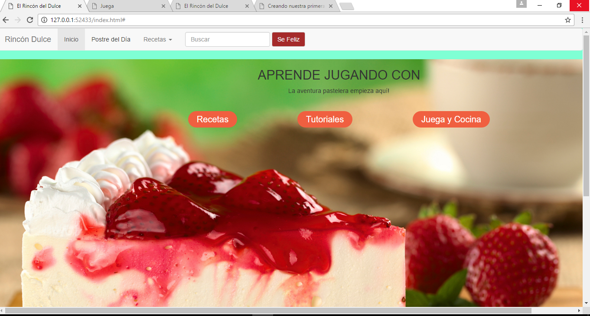

Rincón Dulce:

Breve Descripción:

El proyecto Web Rincón Dulce elaborado en HTML5, CSS3 y JAVASCRIPT, en la cual podemos observamos una pantalla de inicio, la cual cuenta con 3 botones los cuales nos enlaza a diferentes pestañas, una de ellas Recetas, Juega y Tutoriales.
